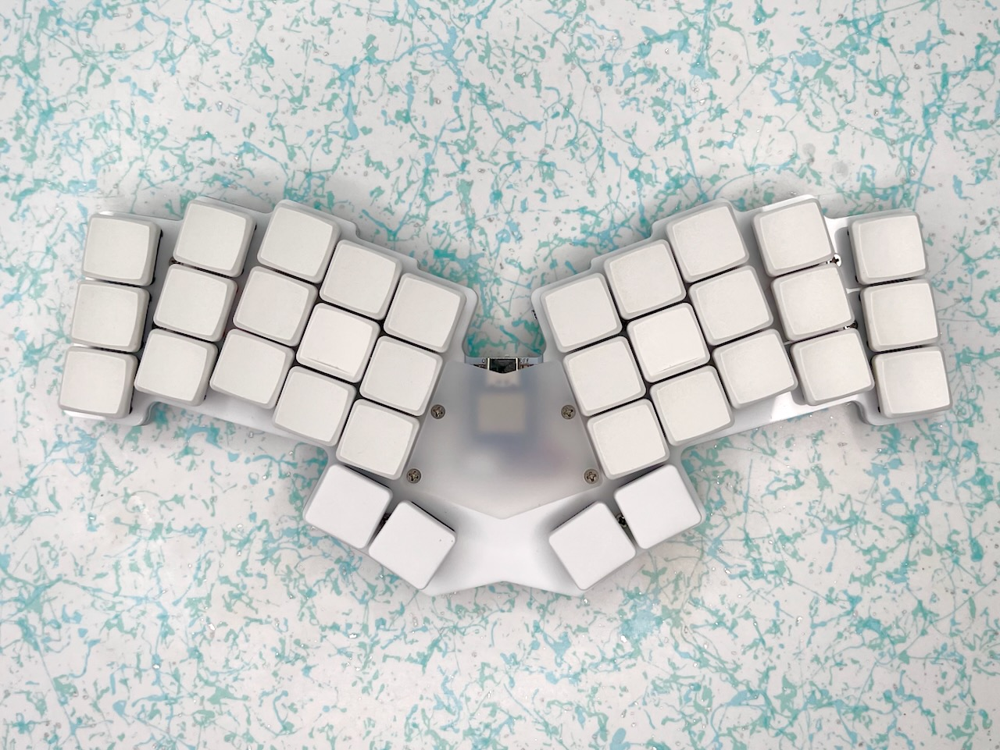

# Re-gret Keyboard

The Re-gret is a 34 key remix of my [Egret](https://github.com/rschenk/egret) keyboard.

Featuring: 34 keys, Choc spacing, Choc v1 hot swappable, Seeed Xiao MCU, wireless compatible, RGB undeglow when plugged in, and a silicone gasket sandwich stackup.

Compared to the original Egret, besides having two thumb buttons per side, the Re-gret has a more angle between the halves, and the ring and pinky fingers have more stagger and more splay. It also has a Xiao MCU which is cheaper and cuter than a Nice Nano. Certainly a more re-fined re-mix that I have no re-grets about making.

Check the docs for a [PCB Build Guide](docs/pcb_build_guide.md) and [Case Build Guide](docs/case_build_guide.md).
